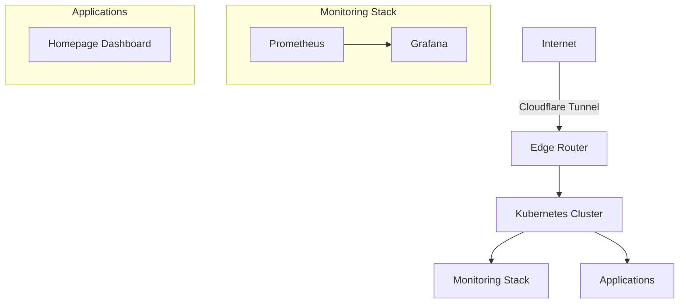

# Architecture Overview

## System Architecture

The homelab is built on several key components working together:



## Component Details

### Core Infrastructure
- **MicroK8s**: Lightweight Kubernetes distribution
  - Handles container orchestration
  - Provides basic cluster services (DNS, storage)
  - Manages pod lifecycle and networking

### GitOps Implementation
- **Flux CD**: Manages cluster state
  - Watches Git repository for changes
  - Automatically reconciles cluster state
  - Handles Helm releases and Kustomizations

### Networking
- **Cloudflare Tunnel**: Secure ingress
  - No exposed ports required
  - Automatic SSL/TLS
  - Zero-trust security model

### Monitoring
- **Prometheus**: Metrics collection
  - Scrapes metrics from services
  - Stores time-series data
  - Handles alerting rules
- **Grafana**: Visualization
  - Displays metrics dashboards
  - Custom dashboards for services
  - Alert visualization

## Directory Structure

```
homelab/
├── apps/                # Application deployments
│   ├── base/            # Base configurations
│   └── production/      # Production overrides
├── infrastructure/      # Core infrastructure
│   ├── configs/         # Infrastructure configurations
│   └── controllers/     # Infrastructure controllers
├── monitoring/          # Monitoring stack
│   ├── configs/         # Monitoring configurations
│   └── controllers/     # Monitoring controllers
└── clusters/            # Cluster-specific configurations
    └── production/      # Production cluster manifests
```

## Security Considerations

- All external access through Cloudflare Tunnel
- No exposed ports on the host machine
- Service mesh ready
- Namespace isolation
- RBAC policies
