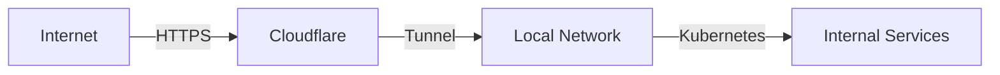

# Networking & Security

## Network Architecture

The homelab uses Cloudflare Tunnels for secure external access:



## Cloudflare Tunnel

### Configuration
Located at `/etc/cloudflared/config.yml`:
```yaml
tunnel: YOUR_TUNNEL_ID
credentials-file: /etc/cloudflared/credentials.json
metrics: 0.0.0.0:2000
ingress:
  - hostname: service.domain.net
    service: http://service.namespace:port
  - service: http_status:404
```

### DNS Configuration
- CNAME records point to tunnel
- Automatic SSL certificate management
- Zero-trust network access

### Metrics
- Connection status
- Traffic statistics
- Error rates
- Latency measurements

## Internal Networking

### Kubernetes Network
- Pod networking through MicroK8s
- Service discovery via kube-dns
- Internal load balancing

### Service Access
- All external access through Cloudflare Tunnel
- Internal services use cluster DNS
- No direct port exposure

## Security Measures

### TLS/SSL
- Automatic certificate management
- End-to-end encryption
- Certificate rotation

### Access Control
- Cloudflare access policies
- Kubernetes RBAC
- Service account restrictions

### Monitoring
- Network traffic monitoring
- Access logs
- Security alerts

## Troubleshooting

### Check Tunnel Status
```bash
systemctl status cloudflared
```

### View Tunnel Logs
```bash
journalctl -u cloudflared
```

### Verify DNS
```bash
dig +short service.domain.net
```

## Common Operations

### Add New Service
1. Add DNS record in Cloudflare
2. Update tunnel config
3. Restart tunnel:
```bash
systemctl restart cloudflared
```

### Check Service Connectivity
```bash
curl -v http://service.namespace.svc.cluster.local
```

### Monitor Network Traffic
```bash
kubectl logs -n monitoring prometheus-operated-0
```
